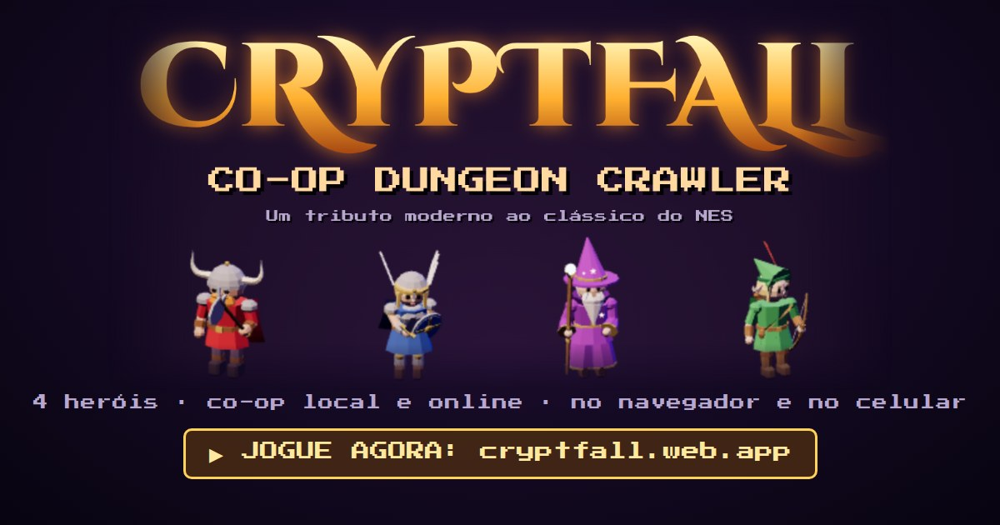

# Cryptfall: Co-op Dungeon Crawler

**▶ Jogue agora: [cryptfall.web.app](https://cryptfall.web.app/)** (grátis, no navegador e no celular)

[](https://cryptfall.web.app/)

Um dungeon crawler cooperativo inspirado no **Gauntlet do NES**, com recursos e jogabilidade modernos — roda direto no navegador, sem dependências, sem build e sem nenhum arquivo de imagem ou áudio (tudo é gerado por código).

## Como jogar

```bash
npm start            # servidor sem dependências (páginas + salas online)
# abra http://localhost:8080
```

Qualquer servidor estático funciona (`npx serve`, `python3 -m http.server`...). Abrir o `index.html` direto do disco não funciona porque o jogo usa módulos ES.

## Som

- **Música no estilo do chip do NES** (2A03): duas ondas quadradas com duty cycle de 12,5/25/50%, triângulo no baixo, ruído na bateria e vibrato nas notas longas. As trilhas ficam em `src/music.js`, num formato de tracker fácil de editar (um compasso = 16 passos, `D5` toca, `-` segura, `.` silencia).
  - Título: abertura da Tocata e Fuga em Ré menor de Bach (domínio público) seguida de um tema de masmorra.
  - Níveis: duas trilhas originais que se alternam. Fim de jogo: vinheta curta.
- **Narrador demoníaco**: as falas são geradas com o eSpeak (`npm run voices`, em `tools/make-voices.mjs`) e ficam em `voice/`. No jogo, passam por efeitos em tempo real: tom mais grave, duas vozes desafinadas, saturação, modulação em anel e eco de masmorra. A música abaixa enquanto ele fala.

## Celular

- Controles de toque: joystick esquerdo move e o herói **mira e atira sozinho** no inimigo mais próximo à vista (dá para desligar na pausa ou mirar manualmente com o joystick direito). Botões » esquiva, ★ especial e ⚗ poção no canto direito.
- Funciona em paisagem e retrato, respeita notch e bordas seguras, mantém a tela acesa durante o jogo e tem botão de tela cheia (Android).
- É um **PWA**: no celular, use "Adicionar à tela inicial" para instalar como app, em tela cheia e com funcionamento offline.

## Publicar no Firebase Hosting

Não há build: os arquivos do repositório já são o site.

```bash
npm i -g firebase-tools
firebase login
firebase use --add        # escolha o projeto
firebase deploy --only hosting
```

O `firebase.json` já está configurado (publica a raiz, ignora `server.js`, `README.md` etc.). Tanto o modo local quanto o online funcionam direto no Hosting.

## Publicar no itch.io

`npm run itch` gera `dist/cryptfall-itch.zip` (só os arquivos que o jogo carrega) para enviar como projeto HTML. Os textos da página, as configurações, a capa e as screenshots estão em `itch/`. Dentro do itch o jogo roda num iframe, então os convites de sala apontam para o `publicUrl` de `src/config.js` (cryptfall.web.app); as salas são as mesmas nos dois lugares.

## Multiplayer online

Funciona **só com o navegador**, sem servidor próprio: os jogadores se conectam direto entre si por **WebRTC**, e o [PeerJS](https://peerjs.com) (serviço público e gratuito) é usado apenas para eles se encontrarem, por alguns segundos.

1. No título, escolha **Criar sala online**. Aparece um código de 4 letras; toque em **Convidar amigos** para mandar o link (`?sala=ABCD`) pelo WhatsApp, Discord etc. (no computador, o link é copiado).
2. Os amigos abrem o link, ou escolhem **Entrar em sala online** e digitam o código.
3. Cada um escolhe um herói e fica PRONTO. O anfitrião clica em **COMEÇAR** (ou ENTER/START) quando todos tiverem entrado.

- Até 4 heróis por partida, misturando jogadores locais (teclado/gamepads do anfitrião) e online. Até 7 convidados podem se conectar, e quem sobra assiste.
- Dá para entrar no meio da partida: quem está assistindo aperta ENTER/START.
- O navegador do anfitrião roda a simulação e envia o estado 20 vezes por segundo. Os convidados veem os inimigos interpolados e o próprio herói com predição local.
- Se o anfitrião fechar a aba, a partida acaba para todos.

### Configuração (`src/config.js`)

Tudo o que está no site é público, então lá só vão endereços e chaves públicas, nunca senhas.

- `transport`: `'peerjs'` (padrão, só navegador) ou `'ws'` (usa o `server.js` como intermediário).
- `peer`: vazio usa a nuvem gratuita do PeerJS com os servidores STUN/TURN padrão dele. Dá para apontar para um servidor PeerJS próprio ou adicionar servidores TURN (exemplo no arquivo).

A biblioteca do PeerJS está em `vendor/peerjs.min.js` (licença MIT), então o jogo não depende de CDN.

### Alternativa com servidor próprio

`npm start` também sobe um intermediário WebSocket de salas. Para usá-lo, abra o jogo com `?transport=ws` (mesmo endereço do servidor) ou `?server=wss://seu-servidor/ws`.

## Gráficos 3D

O jogo é desenhado em 3D (three.js) com os mesmos modelos low-poly do protótipo
HD-2D: heróis, monstros, geradores e chefes animados, luz de tochas e sombras. A
simulação é a mesma do 2D (`src/game.js`), então velocidade, dano, projéteis e o
modo online não mudam; o 3D (`src/view3d.js`) só lê o estado e desenha. O HUD,
os números de dano e os menus continuam na camada 2D por cima.

- Os muros ficam sempre sólidos; um herói atrás de um muro aparece como silhueta na cor do jogador (`src/silhouette.js`).
- A tela inicial e a escolha de heróis também usam os modelos 3D.
- Todos os heróis atiram como no clássico: machado (Guerreiro), espada
  (Valquíria), fogo (Mago) e flecha (Elfo), com a animação de arremesso.
- Desempenho: cada modelo é uma única malha (as cores das peças viram cores por
  vértice, com material Lambert), as sombras vêm de um só spot sobre o primeiro
  herói e só existe uma luz por jogador.
- **Qualidade 3D** (pausa): *Automática* ajusta sozinha resolução, bloom e sombras
  para manter o FPS; *Alta*, *Média* e *Baixa* fixam o nível. **Mostrar FPS** exibe
  o contador e o nível atual. No celular a automática começa sem bloom e sem sombras.
- O 3D vem ligado. O botão **3D | 2d** na tela inicial ou **Gráficos 3D** na pausa troca, e a escolha fica salva; sem WebGL o jogo usa o 2D.

## O que vem do clássico

- Quatro heróis: **Guerreiro**, **Valquíria**, **Mago** e **Elfo**, cada um com velocidade, armadura, ataque e magia diferentes.
- A vida funciona como relógio: cai 1 ponto por segundo. Comida recupera.
- **Geradores** criam hordas sem parar até serem destruídos (e perdem nível conforme apanham).
- Fantasmas, Grunts, Demônios, Lobbers, Feiticeiros invisíveis e a **Morte** (só morre com poção).
- Chaves abrem portas, poções limpam a tela, tesouros dão pontos, amuletos dão poderes temporários.
- "Não atire na comida!" — tiros destroem comida (e atirar numa poção a detona).
- Narrador com as frases icônicas ("O Guerreiro precisa de comida, urgente!") via síntese de voz.

## Chefes

A cada 5 níveis há uma arena de chefe. O caminho até ela tem comida e poções extras, e a saída só aparece quando o chefe cai. Os chefes se revezam e ficam mais fortes a cada rodada (5, 10, 15, depois recomeça):

- **Dragão Vermelho**: sopro de fogo em cone que acompanha o alvo, golpe de cauda ao redor e, na fúria, chuva de meteoros.
- **Necromante**: se teletransporta, dispara anéis de raios e esferas teleguiadas e invoca mortos-vivos.
- **Golem de Pedra**: investida (se bater na parede fica atordoado e leva dano dobrado), ondas de choque que dá para pular com a esquiva e arremesso de pedras.

Com metade da vida o chefe entra em **fúria**: fica mais rápido e agressivo. A vida do chefe cresce com o número de jogadores.

## O que é moderno

- **Controle twin-stick**: mira independente do movimento (mouse, analógico direito ou joystick de toque).
- **Esquiva** com invencibilidade e **habilidade especial** por classe: Redemoinho, Investida, Nova Arcana, Chuva de Flechas.
- **Co-op local para até 4 jogadores** (teclado + gamepads), com **entrada a qualquer momento** (aperte START) e **reviver** o companheiro ficando perto do túmulo.
- Câmera dinâmica que acompanha e dá zoom no grupo.
- **Masmorras procedurais** infinitas com portas trancadas sempre solucionáveis, salas de tesouro e dificuldade crescente.
- **Relíquias** entre os níveis (progressão estilo roguelite).
- IA com pathfinding (campo de fluxo), iluminação dinâmica com tochas, partículas, números de dano, tremor de tela, vibração do controle.
- Música chiptune e efeitos sintetizados em tempo real (WebAudio).
- Controles de toque para celular, minimapa com névoa de guerra, recordes salvos, PT-BR/EN.

## Protótipo 3D (HD-2D)

`proto3d/` é um teste visual separado do jogo: a masmorra real (gerada por
`src/level.js`) em three.js, com luz de tochas, sombras, bloom e tilt-shift. Os
quatro heróis, os seis monstros e os geradores são modelos 3D low-poly animados.
Abra `/proto3d/` no servidor local ou no Firebase.

- **H** troca o herói, **Espaço** ataca, **T** alterna modelo 3D / sprite 32 bits.
- Monstros perseguem, golpeiam e atiram: bola de fogo do Demônio, pedra do
  Arremessador, magia do Feiticeiro. O Feiticeiro some e reaparece.
- Os geradores (pilha de ossos e cabana) soltam novos monstros e podem ser destruídos.
- O herói não morre no protótipo: o HUD conta os monstros abatidos e os golpes recebidos.
- Parado por 3 s, o herói entra em modo demonstração.
- **Chefes em 3D**: **B** (ou o botão Arena) troca entre a masmorra e as arenas
  dos três chefes, que também abrem direto com `?chefe=dragon`, `?chefe=lich` ou
  `?chefe=golem`. Eles usam os ataques do jogo 2D (`src/boss.js`), com barra de
  vida e fúria na metade da vida:
  - **Dragão Vermelho**: sopro de fogo que segue o herói, giro com a cauda e,
    na fúria, chuva de meteoros (círculos vermelhos marcam onde caem).
  - **Necromante**: anel de raios, esferas teleguiadas, invoca mortos-vivos e
    some para reaparecer em outro ponto da arena.
  - **Golem de Pedra**: investida (se bater na parede fica tonto e leva dano
    dobrado), pancada com ondas de choque e arremesso de pedras.
  - Quando o chefe cai, a saída se abre no centro da arena. Na demonstração, o
    herói luta sozinho contra o chefe.

Os modelos são gerados por código no Blender, sem arquivos de arte externos:

```bash
python -m venv bvenv && bvenv/bin/pip install bpy          # Blender 4.5 como módulo Python
bvenv/bin/python tools/blender/warrior3d.py proto3d/models/warrior.glb [pasta_de_previews]
bvenv/bin/python tools/blender/enemies3d.py all proto3d/models [pasta_de_previews]
bvenv/bin/python tools/blender/bosses3d.py all proto3d/models [pasta_de_previews]
node tools/embed-glb.mjs                                    # atualiza os .glb.js
```

Os `.glb.js` são os mesmos modelos em base64, para rodar onde `.glb` não é servido.

## Controles

| Ação | Teclado + mouse | Gamepad | Toque |
|---|---|---|---|
| Mover | WASD | Analógico esquerdo / D-pad | Joystick esquerdo |
| Mirar e atirar | Mouse + clique, ou setas | Analógico direito (ou RT/X na direção atual) | Joystick direito |
| Esquiva | Espaço / Shift | A | » |
| Especial | E / botão direito | RB / B | ★ |
| Poção | Q | Y / LB | ⚗ |
| Mapa | Tab / M | Select | ▦ |
| Pausa | Esc / P | Start | II |
| Entrar no jogo | Enter | Start | toque |

## Estrutura

```
index.html        página + canvas
server.js         servidor local + intermediário WebSocket opcional (npm start)
src/main.js       loop principal, configurações, recordes
src/screens.js    telas: título, seleção, jogo/pausa, relíquias, fim de jogo
src/game.js       simulação: heróis, inimigos, IA, combate, câmera, iluminação
src/boss.js       chefes: IA do Dragão, Necromante e Golem, ondas de choque, vitória
src/level.js      gerador procedural de masmorras
src/render.js     arte procedural 2D (tiles, heróis, monstros, itens)
src/view3d.js     visão 3D do jogo (three.js + modelos de proto3d/models)
src/ui.js         HUD, minimapa, controles de toque
src/input.js      teclado, mouse, gamepads e toque unificados
src/net.js        salas, sincronização de telas e controles remotos
src/transport.js  transportes: WebRTC via PeerJS (padrão) ou WebSocket
src/config.js     configuração do modo online (somente valores públicos)
vendor/           biblioteca PeerJS
src/netgame.js    snapshots do anfitrião; jogo do convidado com interpolação e predição
src/audio.js      efeitos, sequenciador estilo NES e narrador
src/music.js      trilhas sonoras (formato tracker)
voice/            falas do narrador (geradas por tools/make-voices.mjs)
src/heroes.js     classes e relíquias
src/enemies.js    atributos dos monstros
src/i18n.js       textos PT-BR / EN
proto3d/          protótipo 3D HD-2D (three.js): heróis, monstros (monsters.js), chefes (bosses.js), projéteis (shots.js), modelos .glb
tools/blender/    scripts que modelam e animam heróis, monstros, chefes e geradores 3D no Blender
vendor/three/     three.js e os addons usados pelo protótipo
```
